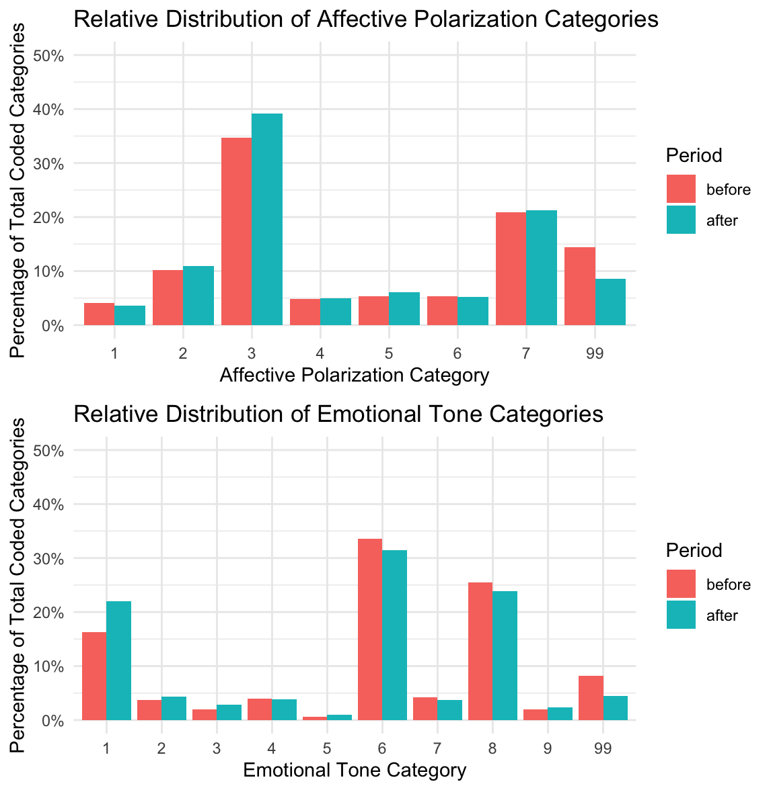

```{r setup, include=FALSE}
knitr::opts_chunk$set(echo = TRUE)
```

## 1 Introduction

This project investigates the impact of political shocks on online political discourse by analyzing Reddit comments from the ukpolitics subreddit. Specifically, the project examines user comments made during the five days preceding and the five days following the announcement of the Brexit referendum results. The primary research question guiding this analysis is: **How does the announcement of the Brexit referendum results, as a political shock, influence the affective polarization present in online political discussions?** By comparing extreme positive and negative comments (with scores of 20 or higher and -10 or lower, respectively), this study seeks to uncover shifts in emotional tone and political sentiment that may signal changes in affective polarization over this critical period.

## 2 Theoretical Background and Hypotheses

Affective polarization, often defined as the degree of emotional, moral, or identity-based division among political groups, is typically measured through large-scale surveys. These surveys assess feelings of warmth or hostility toward political out-groups and are usually conducted on a multi-year cycle, such as after major elections. However, due to their reliance on infrequent, self-reported data, traditional measurements can miss the rapid, dynamic shifts in public sentiment that occur during political shocks. Social media platforms like Reddit offer an alternative data source that captures real-time expressions of affect, providing a window into the immediate impacts of political events.

Political shocks, such as the sudden announcement of the Brexit referendum results, have the potential to rapidly alter the emotional landscape of political discourse. These events can intensify pre-existing divisions or even catalyze new forms of polarization, as individuals react to unexpected outcomes. This study posits that the political shock induced by the Brexit announcement will lead to a measurable increase in affective polarization in online discussions. Based on these insights, one hypothesis guiding the research is that **the level of affective polarization—reflected in both the tone and emotional intensity of user comments—will be significantly higher in the five days following the Brexit announcement compared to the preceding period.**

## 3 Methods

The data for this analysis was sourced from the politosphere dataset. Using provided scripts, comments from the ukpolitics subreddit were extracted for two distinct periods: five days before and five days after the Brexit referendum results were announced. The dataset was further refined to include only those comments that exhibited extreme sentiment, with scores of 20 or higher (positive sentiment) and -10 or lower (negative sentiment). This approach serves as an initial experimental step to gauge changes in affective polarization as a response to the political shock of the Brexit announcement.

For the analytical phase, I employed the ChatGPT API using the 4o model to categorize the comments based on affective polarization and emotional tone. The prompt used for this categorization instructed the model to assess political posts in terms of in-group favoritism, out-group hostility, and overall emotional tone, classifying each comment into pre-defined categories.

**Affective polarization categories:**

1 Extreme Out-Group Hate / Dehumanization<br>
2 High Affective Polarization / Strong Negative Partisanship<br>
3 Moderate Affective Polarization / Negative Stereotyping<br>
4 In-Group Praise / Tribal Solidarity<br>
5 Mixed / Ambivalent Sentiment<br>
6 Depolarizing / Bridge-Building Content<br>
7 Neutral / Non-Polarized Political Content<br>
99 Non-Political Content

**Emotional tone categories:**

1 Anger / Frustration<br>
2 Fear / Anxiety<br>
3 Sadness / Grief<br>
4 Joy / Enthusiasm<br>
5 Compassion / Empathy<br>
6 Sarcasm / Cynicism<br>
7 Disgust / Contempt<br>
8 Neutral / Factual<br>
9 Mixed / Ambiguous Affect<br>
99 Invalid

## 4 Results

The top bar chart displays the relative distribution of affective polarization categories in the five days before and the five days after the announcement of the Brexit referendum results. I focus on percentages rather than raw counts because there were significantly more total comments and posts in the “after” period. Directly comparing absolute frequencies might therefore be misleading. 

Generally, the share of comments with neutral and non-polarized political content (category 7) remains substantial in both periods, suggesting that a large proportion of discussion revolves around relatively straightforward political commentary without strong emotional or partisan overtones. Conversely, there is a noticeable change in categories indicative of negative partisanship or out‐group hostility (1 and 2). To be precise the is a small fall in extreme out-group hate and dehumanization (1) after the referendum results were publicized, but a small rise in high affective polarization and strong negative partisanship (2). The relative amount of posts and comments with high affective polarization therefore stays almost the same, with a slight shift to a less intense wording.

The greatest changes can be seen in moderate affective polarization / negative stereotyping (category 3). The relative coding of this category increased by almost 5 % after the political shock. On the other hand, a decline in comments with non-political content (category 99) can be seen, which also underlines the effect of the shock on more polarizing discussions.


Description of emotional tone category

```{r cars}

```

## 5 Discussion

## 6 Summary

## Literature
