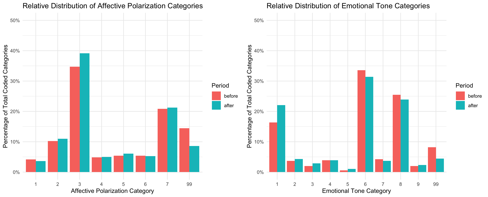
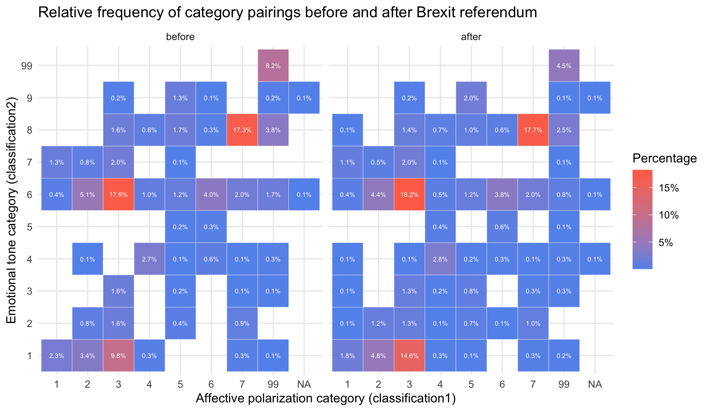

# Affective polarization in the Subreddit r/ukpolitics
##### Oliver Julier, 11.04.2025

### 1. Which data am I using?

This project investigates the impact of political shocks on online political discourse by analyzing Reddit comments from the ukpolitics subreddit. Specifically, the project examines user comments made during the five days preceding and the five days following the announcement of the Brexit referendum results. The primary research question guiding this analysis is: `How does a political shock influence the affective polarization in online political discussions?` By comparing extreme positive and negative comments (with scores of 20 or higher and -10 or lower, respectively), this study seeks to uncover shifts in emotional tone and political sentiment that may signal changes in affective polarization over this critical period.

Affective polarization, often defined as the degree of emotional, moral, or identity-based division among political groups, is typically measured through large-scale surveys. These surveys assess feelings of warmth or hostility toward political out-groups and are usually conducted on a multi-year cycle, such as after major elections. However, due to their reliance on infrequent, self-reported data, traditional measurements can miss the rapid, dynamic shifts in public sentiment that occur during political shocks. Social media platforms like Reddit offer an alternative data source that captures real-time expressions of affect, providing a window into the immediate impacts of political events.

Political shocks, such as the sudden announcement of the Brexit referendum results, have the potential to rapidly alter the emotional landscape of political discourse. These events can intensify pre-existing divisions or even catalyze new forms of polarization, as individuals react to unexpected outcomes. This study posits that the political shock induced by the Brexit announcement will lead to a measurable increase in affective polarization in online discussions.

### 2. Data acquisition

The data for this analysis was sourced from the politosphere data set. Using provided scripts, comments from the ukpolitics subreddit were extracted for two distinct periods: five days before and five days after the Brexit referendum results were announced. The dataset was further refined to include only those comments that exhibited extreme sentiment, with scores of 20 or higher (positive sentiment) and -10 or lower (negative sentiment). This approach serves as an initial experimental step to gauge changes in affective polarization as a response to the political shock of the Brexit announcement.

-   Script for gathering the needed data from the politosphere dataset: `02_scripts/load_comments.py`

### 3. Data processing

For the analytical phase, I employed the ChatGPT API using the 4o model to categorize the comments based on affective polarization and emotional tone. The prompt used for this categorization instructed the model to assess political posts in terms of in-group favoritism, out-group hostility, and overall emotional tone, classifying each comment into pre-defined categories.

-   Script for preparing the needed data and for interacting with the OpenAI API: `02_scripts/process_data.R`

Prompt for categorization by the OpenAI API:

```         
You are an expert in comparative politics, especially in the field of polarization, and are
well-versed in UK politics and European politics in general as well as the issues that were salient in the year 2016. You have 2 tasks involving the classification of posts and replies in the Subreddit ukpolitics in October 2016. 
Important: before printing your answer, double check to make sure that you provide the most accurate classification possible.

# TASK 1 – Affective Polarization in Subreddits
Assess the extent to which a post expresses affective polarization—i.e., emotional, moral, or identity-based division toward political or social groups. This includes expressions of in-group favoritism, out-group hostility, dehumanization, ridicule, or moral condemnation. Posts can reflect polarization explicitly (e.g., attacks on opposing groups) or implicitly (e.g., sarcasm, moral disgust, or tribal language). Classify posts based on the dominant tone and emotional stance toward political or social groups.
 
## List of Categories (Use only the code in the final classification)
 
1: **Extreme Out-Group Hate / Dehumanization** – Expresses contempt, disgust, or hatred toward opposing political or social groups. May include moral condemnation, demonization, or calls for exclusion, violence, or punishment.
 
2: **High Affective Polarization / Strong Negative Partisanship** – Displays strong emotional dislike or distrust toward opposing groups or ideologies. Includes intense sarcasm, ridicule, name-calling, or claims of existential threat posed by the out-group.
 
3: **Moderate Affective Polarization / Negative Stereotyping** – Conveys emotional distance or negative generalizations about other groups. May involve blame, mild insults, or expressions of superiority without extreme hostility.
 
4: **In-Group Praise / Tribal Solidarity** – Highlights emotional connection, loyalty, or moral superiority of one’s own group without necessarily attacking others. Focuses on group pride, shared identity, or virtue signaling.
 
5: **Mixed / Ambivalent Sentiment** – Expresses both in-group and out-group sentiments, or shifts tone across the post. May include both criticism and praise, or present a nuanced emotional stance.
 
6: **Depolarizing / Bridge-Building Content** – Promotes empathy, mutual understanding, or respectful disagreement. Rejects tribalism or calls for cooperation, tolerance, or shared humanity.
 
7: **Neutral / Non-Polarized Political Content** – Engages with politics but without emotional language, hostility, or group-based framing. May involve policy discussion, information sharing, or procedural commentary.
 
99: **Non-Political Content** – The post does not address political, ideological, or group-based topics. Includes entertainment, memes, or everyday conversation.
 
## Example 1
Post: “The other side doesn’t want compromise—they want to destroy everything decent. You can’t reason with that.” 
Response: 2

## Example 2
Post: “It doesn't make sense to discuss about the past. We have to look for solutions together now.” 
Response: 6

# TASK 2 – Emotional Tone (Affect) in Social Media Posts 
Assess the dominant emotional tone conveyed in the post, based on the author's language, framing, and affective cues. Consider explicit emotional expressions (e.g., “I’m angry,” “this is wonderful”) and implicit indicators (e.g., sarcasm, exclamation marks, emotionally loaded adjectives). Classify posts according to their **primary emotional tone**, even if multiple emotions are present. If no clear emotional tone is detectable, choose the neutral category.
 
## List of Categories (Use only the code in the final classification)
 
1: **Anger / Frustration** – Expresses irritation, outrage, resentment, or moral indignation. May include rants, blame, sarcasm, or emotionally charged critique.
 
2: **Fear / Anxiety** – Reflects worry, dread, panic, or concern about future events. Often uses uncertain or alarming language, especially about threats or instability.
 
3: **Sadness / Grief** – Conveys sorrow, loss, disappointment, or hopelessness. May include personal stories of pain, social critique with a mournful tone, or empathetic reflections.
 
4: **Joy / Enthusiasm** – Expresses happiness, excitement, inspiration, or celebration. Often includes praise, humor, success stories, or emotional uplift.
 
5: **Compassion / Empathy** – Shows care, sympathy, or emotional support toward others. May involve solidarity, kindness, or appeals to shared humanity.
 
6: **Sarcasm / Cynicism** – Uses ironic tone, mockery, or skeptical humor to distance the author from the topic. May mask underlying emotions such as anger or disappointment.
 
7: **Disgust / Contempt** – Communicates revulsion, moral rejection, or condescension. May include moralistic language, ridicule, or expressions of being offended.
 
8: **Neutral / Factual** – The post maintains a neutral tone without affective charge. It presents information, asks questions, or reflects without emotional expression.
 
9: **Mixed / Ambiguous Affect** – Multiple emotions are equally present, or the tone is unclear. May include contrastive elements, vague tone, or emotionally confusing content.

99: **Invalid** – Could not be assigned to any of the categories.
 
## Example 1
Post: “I can’t believe people are STILL defending this nonsense. It’s infuriating.” 
Response: 1

## Example 2
Post: “Finally, some good news.” 
Response: 4

# Coding format
Do both tasks and then print only the two codes of the classifications separated by a comma.
Use code 99 for Task 1 and code 99 for Task 2 as a last resort if you cannot assign any category.

Only use the output format presented in the following two examples:
Example 1 of final output: 2, 1
Example 2 of final output: 6, 5
```

### 4. Data analysis

The left bar chart displays the relative distribution of affective polarization categories in the five days before and the five days after the announcement of the Brexit referendum results. I focus on percentages rather than raw counts because there were significantly more total comments and posts in the “after” period. Directly comparing absolute frequencies might therefore be misleading.

Generally, the share of comments with neutral and non-polarized political content (category 7) remains substantial in both periods, suggesting that a large proportion of discussion revolves around relatively straightforward political commentary without strong emotional or partisan overtones. Conversely, there is a noticeable change in categories indicative of negative partisanship or out‐group hostility (category 1 and 2). To be precise the is a small fall in extreme out-group hate and dehumanization (category 1) after the referendum results were publicized, but a small rise in high affective polarization and strong negative partisanship (category 2). The relative amount of posts and comments with high affective polarization therefore stays almost the same, with a slight shift to a less intense wording.

The greatest changes can be seen in moderate affective polarization / negative stereotyping (category 3). The relative coding of this category increased by almost 5 % after the political shock. On the other hand, a decline in comments with non-political content (category 99) can be seen, which also underlines the effect of the shock on more polarizing discussions.



Turning to the right bar chart, which shows the distribution of emotional tone categories, we again see a shift in the percentages before and after the referendum announcement. Increasing anger and frustration (category 1) and dicreasing sarcasm and cynicism (category 6) relative to other emotions are indicators for a more charged environment once the referendum outcome was clear. This could be an indication that people discussed things less cryptically and less on a humorous level after the shock. Also, fear and anxiety (category 2) as well as sadness and grief (category 3) experience a small increase in frequency. Nevertheless, neutral and factual (category 8) appears consistently high, indicating that a sizeable portion of users simply relayed information or discussed political events calmly, regardless of the shock. These preliminary observations help me identify where emotional intensity might have spiked - or, conversely, remained stable - across different points in time.

Because these plots rely on relative frequencies, they highlight differences in how the community’s discourse composition changed, rather than being influenced by the overall surge in activity. Notably, there was a substantial rise in the total volume of posts after the referendum, suggesting widespread engagement with the event.

This heat map visualizes not only the prevalence of individual classification categories but also how pairs of affective polarization and emotional tone co-occur in the subreddit comments. By representing these combinations, I gain valuable insights into the interplay between the intensity of partisan sentiment and the underlying emotional expressions - an analysis that would be hidden if only individual category frequencies were displayed.



A first look already gives insight to the dominant combinations of the subreddit. Moderate affective polarization (category 3) in combination with sarcasm (category 6) is the most frequently occuring pair in the data set - before and after the political shock. A very small increase in .3 percent is to be seen after the announcement. A second frequently occurring combination, which also remains stable in percentage terms despite the shock, is the pair of the neutral codes of both classification variables (AP category 7 and ET category 8).

Another finding from the heat map is in line with the descriptive statistics from before. The combinations between the emotional tone category for anger and frustration with high and moderate affective polarization increase in frequency in percentage terms. This can certainly also be explained by the sheer increase in comments classified with anger.

-   Script for analysing data and creating plots: `03_analysis/analyse_data.R`

### 5. Limitations

One limitation of this study lies in the inherent challenges of working with user-generated content and automated text classification. Initially, a substantial number of NA values were produced by the classification function - likely due to transient API issues or rate limiting - which I drastically reduced by introducing a delay with Sys.sleep. Although this improvement enhanced the overall classification rate, the final codes were not systematically validated: I only performed occasional manual checks on selected rows to verify consistency, leaving room for potential misclassification errors. 

Additionally, biases inherent in user-generated data—such as self-selection bias, the influence of echo chambers, and the possibility of trolling or exaggeration—could affect the representativeness of the findings. These factors, combined with the limitations in our automated classification approach, suggest that while the results offer valuable descriptive insights into the dynamics of political discourse, they should be interpreted with caution and supplemented by further rigorous validation and inferential analyses.

### 6. Summary

This project investigates how a political shock - in this case, the announcement of the Brexit referendum results - influences affective polarization in online political discussions within the ukpolitics subreddit. By focusing on comments with extreme sentiment in the five days before and after the announcement, the analysis examines both the standalone prevalence of affective polarization and the interplay between affective polarization and emotional tone through paired category visualizations. The results indicate noticeable shifts in category distributions: although neutral content remains dominant, there is a small decline in extreme out-group hate and a corresponding rise in expressions of high polarization and moderate stereotyping after the announcement. Moreover, the heat map of paired categories highlights that combinations - such as moderate affective polarization paired with sarcasm - remain the most frequent, while other combinations involving expressions of anger become slightly more prevalent after the shock.

While these descriptive findings provide an important snapshot of how political shocks might alter online discourse, further analyses (such as inferential statistics, regression modeling, or topic network analysis) could uncover causal factors and predictive patterns within the data. As a next step, I plan to leverage this data - and/or similar datasets - in my Bachelor’s thesis, thereby extending the descriptive insights gathered here into a more robust and comprehensive study of political discourse dynamics.